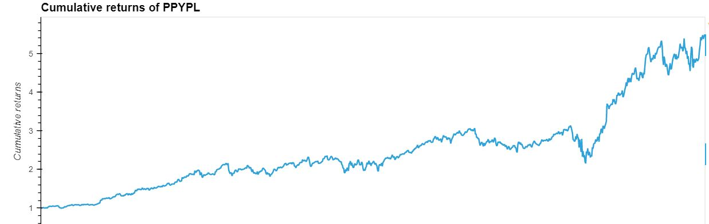
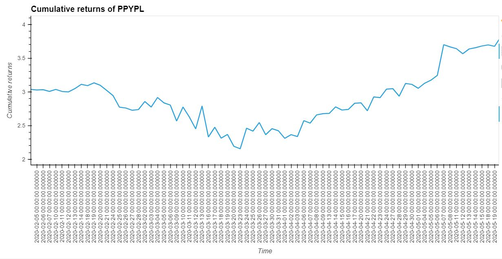
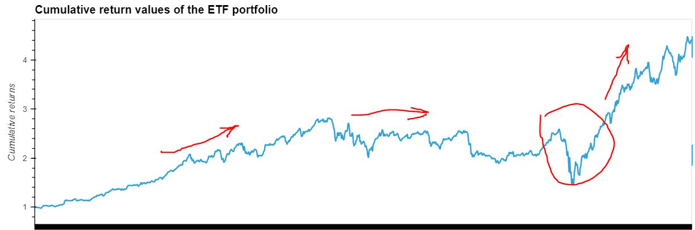

# Web-Application-for-an-ETF-Analyzer

This repository represents financial database and web application were built by using SQL, Python. The Voilà libraries is also used to analyze the performance of a hypothetical fintech ETF.

---

## Approach

* Analysising of the ETF data that a SQL database stores
* Styling and formatting of the interactive visualizations
* Deploying Jupyter notebook via the Voilà library

---

## Technologies

This project leverages the following tools for financial analysis:

* [Conda](https://docs.conda.io/en/latest/) - source package management system and environment management system.

* [Pandas](https://pandas.pydata.org) - Python library that’s designed specifically for data analysis.

* [JupyterLab](https://jupyter.org) - For running and review Python-based programs.

* [PyViz - hvPlot](https://hvplot.holoviz.org) - a high-level plotting API.

* [Python - sqlalchemy](https://www.sqlalchemy.org) - for working with SQL.

* [Voila libraries](https://voila.readthedocs.io/en/stable/) - to standalone web applications and dashboards.

---

## Input data

SQL database - ```etf.db```, contains 4 tables ```[GDOT, GS, PYPL, SQ]```

## How to run Voila app

1. Install ```pip install SQLAlchemy```
2. Install ```conda install -c conda-forge voila```
3. open terminal in the project folder
4. Run ```voila etf_analyzer.ipynb```

Pls, refer the video:

<a href="http://www.youtube.com/watch?feature=player_embedded&v=dyYD3aUHhH8
" target="_blank"></a>

## Analyze a single asset (PYPL) in the FinTech ETF

Based on the analysis, the cumulative return from 2016 to 2020 is gradually increasing.



However, in 2020 from February to March, there was a sharp decrease in the cumulative return.



## Analyze the Fintech ETF Portfolio

The cumulative return of the entire portfolio looks about the same as the PYPL.
Basically, there is an upward trend.



---

## Contributors

Vladislav Glupak - [Linkedin](https://www.linkedin.com/in/vladislav-glupak/)

---

## License

It is an Open-source analysis.

